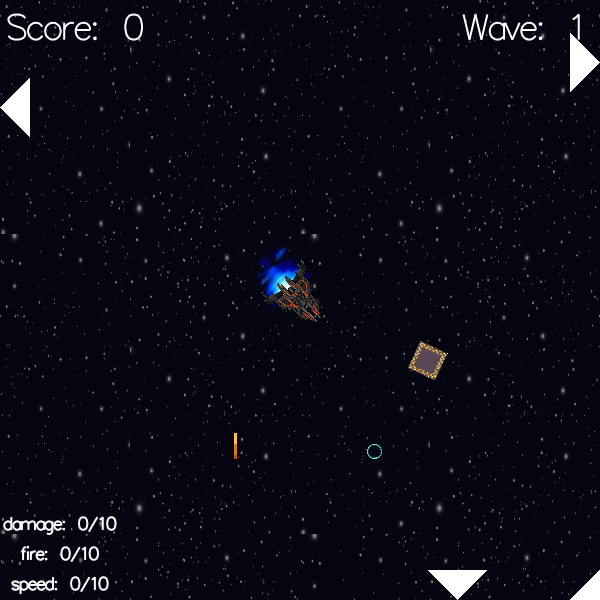
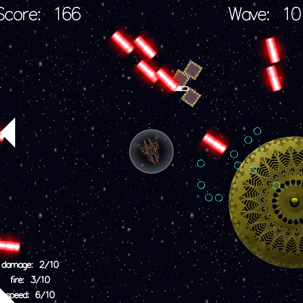

# Twin-Stick Shooter Game 1

A game heavily inspired by [Super Stardust](https://en.wikipedia.org/wiki/Super_Stardust_HD) in a world with not enough good twin-stick shooters.

(This game uses keyboard and mouse so "twin-stick" is only to describe the genre.)

Code is pretty hacky, but at least the game is playable!

## Requirements

* 2GHz+ CPU is probably enough
* ~100MB RAM
* Windows: 64-bit

Pre-built binaries are [provided](https://github.com/tanksdude/twin-stick-shooter-game-1/releases) for Windows. Linux must compile from source.

### Compiling from source

Windows: just get Visual Studio and compile

Linux:

1. Prerequisites: a compiler, CMake, freeglut, GLEW: `sudo apt install build-essential cmake freeglut3-dev libglew-dev`
1. `mkdir build && cd build`
1. `cmake .. -DCMAKE_BUILD_TYPE=Release`
1. `make -j$(nproc)`
1. TODO: also copy `images/` to the build dir, *otherwise you'll only get white squares*
1. `./twin-stick-shooter-game-1`

## License

GNU General Public License v3.0

`SPDX-License-Identifier: GPL-3.0-only`

## Acknowledgments

* The [Super Stardust](https://en.wikipedia.org/wiki/Super_Stardust_HD) series (*very* highly recommended!)
* [PowerTanks Battle](https://github.com/tanksdude/tanks-game) (made by me)
* All the twin-stick shooters I've played in the past, both good and bad (but mostly the good ones)

## Good twin-stick shooters

There's a clear lack of twin-stick shooters in the world. Here are some good ones. (PC-focus since I don't really know anything other than Super Stardust on console.)

* [Geometry Wars 3](https://en.wikipedia.org/wiki/Geometry_Wars_3:_Dimensions): haven't played this yet but it's considered the closest to Super Stardust on PC
* [Nex Machina](https://en.wikipedia.org/wiki/Nex_Machina): made by the same people who made Super Stardust! it's sad that the game didn't sell well so the developers don't work on twin-stick shooters anymore
* [Enter the Gungeon](https://en.wikipedia.org/wiki/Enter_the_Gungeon): more bullet hell than twin-stick shooter, but definitely good
* [Null Vector](https://store.steampowered.com/app/608110/Null_Vector/): the upgrade system was very well done, making the risk vs. reward thought process with each upgrade very meaningful

### Ones I haven't played but are considered good:

* [Nuclear Throne](https://en.wikipedia.org/wiki/Nuclear_Throne): considered very, very good
* [Ruiner](https://en.wikipedia.org/wiki/Ruiner_(video_game)): considered very good
* [Neon Chrome](https://en.wikipedia.org/wiki/Neon_Chrome): considered good

## Special note: bad or meh twin-stick shooters

Some twin-stick shooters are just bad. It takes a lot of work to make a game, and it takes a lot of focus to make a twin-stick shooter good. These twin-stick shooters are not good due to various reasons.

* (Bad) [Nier Automata](https://en.wikipedia.org/wiki/Nier:_Automata)'s hacking minigame: extremely simple, no depth, very repetitive; although it's just a minigame, so much more could have been done (also the base game wasn't great, but that's a different topic); also the driving force behind making this section
* (Meh) [Assault Android Cactus](https://en.wikipedia.org/wiki/Assault_Android_Cactus): decent, but the variety comes from the different characters to play as, which isn't very fun, also somewhat repetitive
* (Meh) [PixelJunk Shooter](https://en.wikipedia.org/wiki/PixelJunk_Shooter): it's not an action-focused twin-stick shooter, which is why it doesn't capture my attention; however, the main gimmick was the particle effects on the brand-new PS3, not the twin-stick shooting
* (Bad) [Furious Angels](https://store.steampowered.com/app/551450/Furious_Angels/): cool concept, did not evolve beyond that; it's just shooting things until you die
* (Meh/Bad) [THOTH](https://en.wikipedia.org/wiki/Thoth_(video_game)): kinda hard, not much going on; pretty sure I a least completed it but it wasn't fun
* (Bad) [Tormentor X Punisher](https://store.steampowered.com/app/500670/TormentorPunisher/): takes too long for things to get interesting, and the upgrades were kinda annoying; also the name having the U+274C character in its name is so annoying
* (Bad) [Chippy](https://store.steampowered.com/app/602700/Chippy/): requires great precision to chip off parts of bosses, and the bosses are not fun when there's only one way to beat them, and a lot of bad design decisions along the way; however, other people say it's good, so make your decision
* (Bad) [Devader](https://store.steampowered.com/app/706850/Devader/): sorry little indie dev, but it's not fun; it's not really an arcade game, since it has a campaign to go through, and you have limited upgrade choices, oh and you can't undo any choice, and you have limited lives (why)
* (Meh) [Stardust Galaxy Warriors: Stellar Climax](https://en.wikipedia.org/wiki/Dreamloop_Games#Games): actually, it's a shoot 'em up, which definitely isn't twin-stick shooting... but nothing felt powerful, and everything felt too old-school; however, I'm including this because the customization options and accessibility options are great
* (Bad) [Tokyo 42](https://en.wikipedia.org/wiki/Tokyo_42): focuses more on the adventuring than the twin-stick shooting, but the isometric view makes aiming hard and shooting annoying, the stealth system was overused, and 100%ing it is not fun
* (Good) [REVOLVER360 RE:ACTOR](https://store.steampowered.com/app/313400/REVOLVER360_REACTOR/): again, it's a shoot 'em up, but it's so freakin' cool; kinda hard but it's so interesting
* (Good) [Heat Signature](https://en.wikipedia.org/wiki/Heat_Signature_(video_game)): not really a twin-stick shooter but it's really good!
